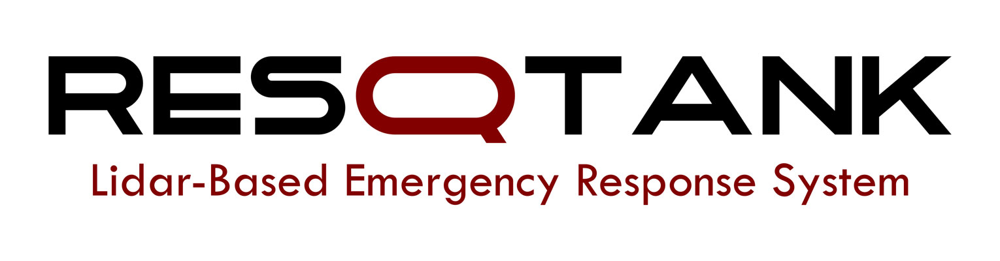
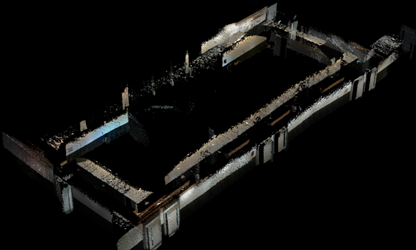
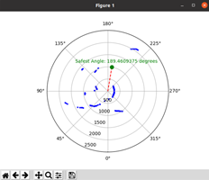
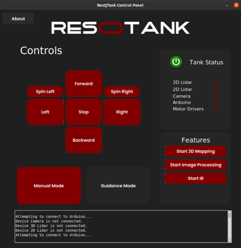
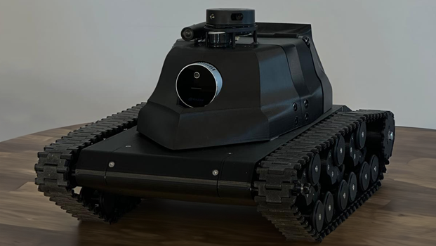

# ResQTank Project


# Description
ResQTank is an advanced Lidar-based emergency response system designed for rapid and efficient disaster response in indoor environments. This project was developed as part of our graduation capstone project at the American University of Kuwait. It utilizes cutting-edge technology to 3D map while detecting people and navigating through complex environments effectively.


## Key Features
- **Real-Time 3D Mapping**: Leverages RTAB-Map for real-time 3D mapping.
- **AI People Detection**: Utilizes advanced AI algorithms for accurate detection and tracking.
- **Smart Guidance System**: Path assistance for safe navigation in light and dark environments. 
- **Responsive User Interface**: Feature-rich control panel GUI for easy monitoring and control.

## Hardware Customization
This project is primarily focused on the software components of the ResQTank system. While we have chosen a tank design for its versatility and adaptability in various environments, the software can be customized to work with different types of robots or vehicles. The flexibility of the software allows it to be integrated with various hardware configurations, making it suitable for a wide range of applications. Feel free to modify the hardware setup according to your specific requirements.



## Installation

### Prerequisites
Before you begin, ensure you have the following installed:
- Python 3.x
- NVIDIA JetPack (for Jetson modules)
- Arduino IDE (for Arduino code)


### Setting Up Python Environment
1. Clone the repository:
   ```
   git clone https://github.com/odxxt/resqtank.git
   ```
2. Navigate to the project directory:
   ```
   cd resqtank
   ```
3. Install Python dependencies:
   ```
   pip install -r requirements.txt
   ```

### Additional Dependencies
Some components used in this project are not available through pip and need to be set up separately:


#### NVIDIA Jetson Inference
- The Jetson Inference library is not part of the NVIDIA JetPack SDK. Instead, it can be installed from the `dusty-nv/jetson-inference` GitHub repository.
- To install and configure Jetson Inference, follow the guide for building the project from source:
  [Building Jetson Inference from Source](https://github.com/dusty-nv/jetson-inference/blob/master/docs/building-repo-2.md#building-the-project-from-source).
- Ensure you follow the steps specifically tailored to your Jetson model. This method is recommended as we did not use any container for this project.


#### Intel RealSense SDK
- The Intel RealSense SDK can be installed on NVIDIA Jetson devices, including the Jetson Orin Nano, following the instructions outlined in the `installation_jetson.md`. This guide provides comprehensive steps for setting up on various Jetson models.
- For our project, we specifically installed the SDK by building it from source using the RSUSB Backend. This method is particularly well-suited for environments like the Jetson Orin Nano, ensuring optimal compatibility and performance.
- The installation guide can be found here: [Intel RealSense SDK Installation on NVIDIA Jetson Devices](https://github.com/IntelRealSense/librealsense/blob/master/doc/installation_jetson.md#nvidia-jetson-devices).


#### RTAB-Map for Intel RealSense L515
- RTAB-Map installation details can be found on the [official RTAB-Map GitHub page](https://github.com/introlab/rtabmap).
- Ensure to configure it specifically for Intel RealSense L515 as described in their setup. 
- For our project, we have included a custom configuration file `config.ini` located in the `rtabmap_config` folder. This configuration has been optimized for the best performance in controlled indoor environments using the Intel RealSense L515. We recommend using this configuration to replicate our results.

## Arduino Setup
The Arduino Uno is programmed to interface with the [Cytron 20Amp 6V-30V DC Motor Drivers](https://www.cytron.io/p-20amp-6v-30v-dc-motor-driver), controlling the movement of the motors based on serial commands. The specific Arduino code can be found in the repository.

##### Motor Driver Configuration
The provided Arduino script is configured for the Cytron motor driver. This setup controls various movements through serial commands as detailed in the table below. If you are using a different motor driver, the code can be easily adapted by modifying the motor control commands. The structure of the code is straightforward and simple, allowing for easy modifications.

##### Control Commands
Here is a table of serial commands and their corresponding movements, along with the keyboard bindings used in our control interface:

| Char | Keyboard Bind    | Command      |
|------|------------------|--------------|
| 'f'  | W or arrow-up    | Forward      |
| 'b'  | S or arrow-down  | Backward     |
| 'r'  | D or arrow-right | Right        |
| 'l'  | A or arrow-left  | Left         |
| 'e'  | E                | Spin Right   |
| 'q'  | Q                | Spin Left    |

To modify or customize the Arduino code for different motor drivers, adjust the motor control functions within the script to match the input specifications and control methods of the new driver. This customization allows the ResQTank to be adaptable to a variety of hardware configurations.

## Usage
### Running the GUI Control Panel
To run the GUI control panel, navigate to the `control_panel` folder and execute the `gui.py` file using Python. Ensure you have all dependencies installed as per the [Installation](#installation) section.

1. Open a terminal and navigate to the `control_panel` directory:
   ```bash
   cd control_panel
   ```
2. Run the `gui.py` file:
   ```bash
   python3 gui.py
   ```

### Navigating the GUI

Once the GUI is running, you will see the ResQTank Control Panel as shown below:


#### Controls Section
The control panel includes buttons for various movement controls of the tank, such as moving forward, backward, turning left, turning right, and stopping. These controls can also be operated using keyboard inputs:
- **Movement**: Use `W`, `A`, `S`, `D`, or the `arrow keys` for forward, left, backward, and right movements respectively.
- **Additional Controls**: Use `Q`, `E`, `C`, and `Z` for additional movements and commands.
- **Manual Mode**: Activates manual control mode.
- **Guidance Mode**: Activates assisted guidance mode.

#### Tank Status
This section displays the connection status of various components, including the 3D Lidar, 2D Lidar, camera, Arduino, and motor drivers. Each status indicator runs on a separate thread, ensuring real-time updates and responsiveness without blocking the main GUI thread. A green indicator means the device is connected, while a red indicator means it is not connected.

#### Features Section
This section includes buttons to start various features of the ResQTank, these includes the following: 
- **Start 3D Mapping**: Begins the 3D mapping process.
- **Start Image Processing**: Starts the image processing algorithms.
- **Start IR**: Activates the infrared sensor for dark environments.

Each function button in the Features tab triggers a separate subprocess, allowing these operations to run independently and concurrently with the main GUI. This ensures that resource-intensive tasks do not interfere with the responsiveness of the user interface.


#### Terminal Output
The terminal output at the bottom of the GUI provides real-time feedback on the system's status, including connection attempts and error messages.

By following these instructions, you should be able to run and navigate the ResQTank GUI control panel effectively. Adjust any settings or controls as necessary based on your specific hardware configuration and project requirements.


## Contributing
We welcome contributions! If you would like to help make ResQTank better, please feel free to fork the repository and submit a pull request.

## License
This project is licensed under the MIT License - see the [LICENSE](LICENSE) file for details.

## Authors
- Abdulaziz AlOdat
- Adnan Kazi
- Alexandre Meulien
- Amer Ammar

## Acknowledgments
- A heartfelt thank you to our supervisor, Dr. Mounib Khanafer, for his guidance and support throughout this graduation capstone project.
- Thanks to all the contributors who have invested their time into making ResQTank a reality, especialy our peers and colleagues who offered valuable feedback and assistance during the development process.
- Thank you to the makers and developers of open-source libraries and tools, without which this project would not have been possible.
